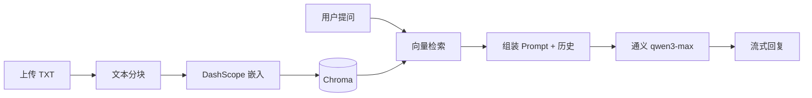

# RAG 智能客服项目

基于 **LangChain** + **Chroma** + **阿里云通义（DashScope）** 的检索增强生成（RAG）示例。面向服装电商场景，支持知识库上传、向量检索与带历史记忆的流式问答。

## 功能概览

| 模块 | 说明 |
|------|------|
| 知识库更新 | 上传 TXT 文本，分块后写入 Chroma 向量库，并按内容 MD5 去重 |
| 智能客服 | 根据用户问题检索相关文档，结合对话历史由大模型生成回答 |
| 对话记忆 | 按 `session_id` 将会话持久化到本地 JSON 文件 |

## 项目结构

```
RAG项目/
├── app_file_uploader.py   # Streamlit：知识库上传页面
├── app_qa.py              # Streamlit：智能客服对话页面
├── knowledge_base.py      # 知识库写入（分块、向量化、MD5 去重）
├── rag.py                 # RAG 链路（检索 + Prompt + 通义对话模型）
├── vector_stores.py       # Chroma 向量库与检索器封装
├── file_history_store.py  # 基于文件的聊天历史存储
├── config_data.py         # 全局配置（模型、分块、会话等）
├── data/                  # 示例知识文档（尺码、洗涤养护、颜色选择等）
├── chroma_db/             # Chroma 持久化目录（运行后自动生成）
├── md5.text               # 已入库内容的 MD5 记录（运行后自动生成）
└── chat_history/          # 会话历史目录（运行后自动生成）
```

## 技术栈

- **Web 界面**：Streamlit
- **编排框架**：LangChain
- **向量数据库**：Chroma
- **嵌入模型**：DashScope `text-embedding-v4`
- **对话模型**：通义 `qwen3-max`（`ChatTongyi`）

## 环境要求

- Python 3.10+
- 有效的 [阿里云 DashScope API Key](https://help.aliyun.com/zh/model-studio/get-api-key)

## 安装依赖

```bash
pip install streamlit langchain-core langchain-community langchain-chroma chromadb dashscope
```

> 若使用虚拟环境，建议先创建并激活后再安装。

## 配置 API Key

通义相关组件通过环境变量读取密钥（LangChain DashScope 集成惯例）：

**Windows（PowerShell）：**

```powershell
$env:DASHSCOPE_API_KEY = "你的API密钥"
```

**Linux / macOS：**

```bash
export DASHSCOPE_API_KEY="你的API密钥"
```

主要可调参数见 `config_data.py`：

| 配置项 | 默认值 | 说明 |
|--------|--------|------|
| `chunk_size` | 1000 | 文本分块最大长度 |
| `chunk_overlap` | 100 | 分块重叠字符数 |
| `similarity_threshold` | 1 | 检索返回文档数量（`k`） |
| `embedding_model_name` | text-embedding-v4 | 嵌入模型 |
| `chat_model_name` | qwen3-max | 对话模型 |
| `session_config` | user_001 | 默认会话 ID |

## 使用方式

### 1. 初始化知识库（上传文档）

启动知识库更新服务：

```bash
streamlit run app_file_uploader.py
```

在浏览器中上传 **UTF-8 编码的 TXT 文件**。系统会：

1. 计算全文 MD5，若已入库则跳过；
2. 按配置分块（超长文本自动分割）；
3. 写入 Chroma，并记录 MD5。

也可将 `data/` 目录下的示例文件通过该页面上传，或在本机用 `knowledge_base.py` 直接调用 `KnowledgeBaseService.upload_by_str()`。

### 2. 启动智能客服

```bash
streamlit run app_qa.py
```

在聊天框输入问题，例如：

- 「我身高 170、体重 140 斤，穿什么码？」
- 「针织毛衣如何保养？」

回答将结合向量检索到的片段与当前会话历史流式输出。

### 3. 命令行调试（可选）

```bash
# 测试 RAG 链路
python rag.py

# 测试向量检索
python vector_stores.py

# 测试知识库写入
python knowledge_base.py
```

## 工作流程



## 示例知识库

`data/` 目录预置三类客服知识，便于演示：

- `尺码推荐.txt` — 身高体重与尺码对照
- `洗涤养护.txt` — 各季面料洗涤与保养说明
- `颜色选择.txt` — 配色与选色建议

## 注意事项

1. **先入库再问答**：未向向量库写入任何文档时，检索结果为空，模型仅能依赖通用能力回答。
2. **编码格式**：上传文件需为 UTF-8，否则可能出现解码错误。
3. **去重逻辑**：相同内容的 MD5 只会入库一次；修改文档后需变更内容才会再次写入。
4. **会话隔离**：修改 `config_data.py` 中的 `session_config["configurable"]["session_id"]` 可区分不同用户的历史记录文件（位于 `chat_history/`）。
5. **数据目录**：`chroma_db/`、`md5.text`、`chat_history/` 为运行时数据，迁移或备份项目时请一并考虑。

## 许可证

本项目为课程/学习案例，仅供学习交流使用。
